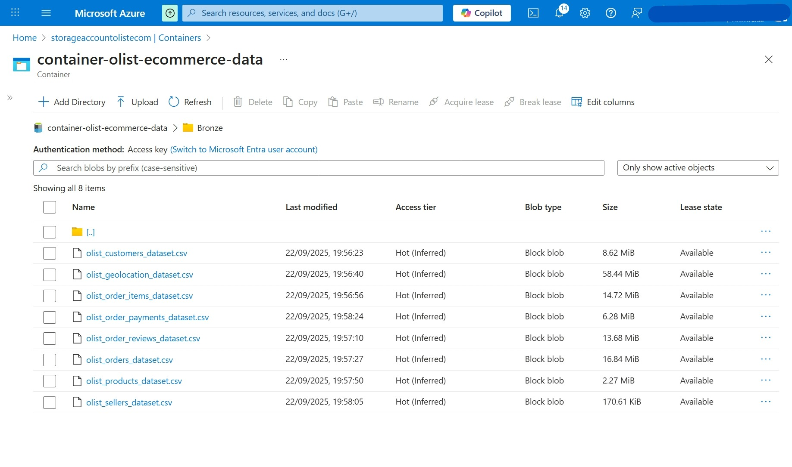
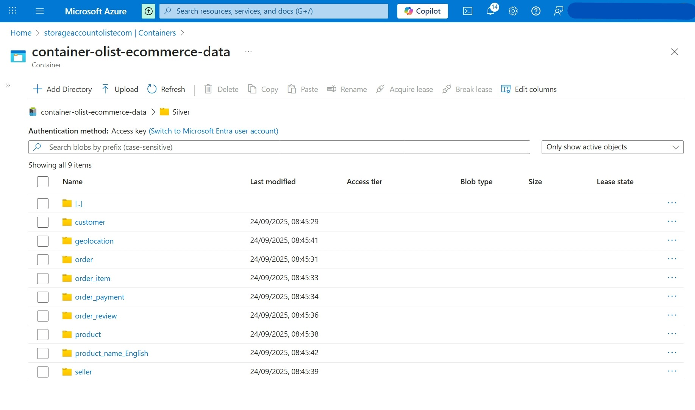
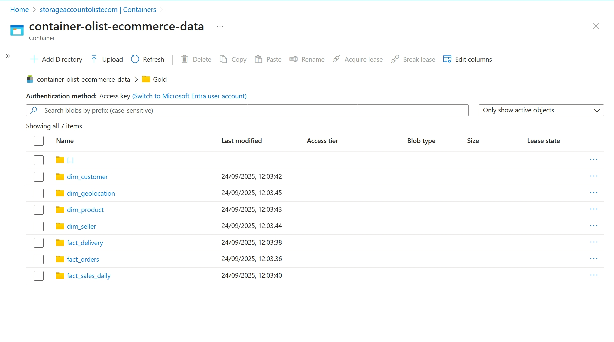
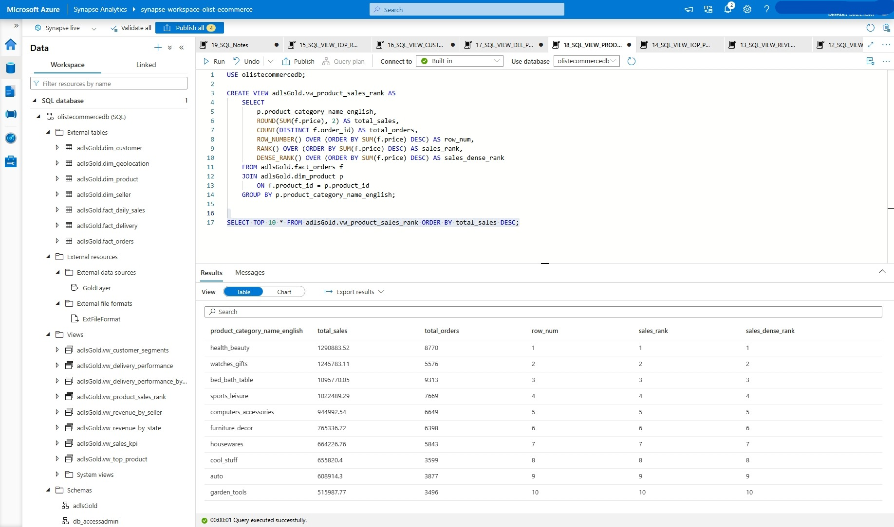

# 🛒 Olist E-Commerce Data Pipeline

[](https://azure.microsoft.com/)
[](https://databricks.com/)
[](https://spark.apache.org/)
[](https://www.mysql.com/)
[](https://www.mongodb.com/)
[](https://www.python.org/)
[](https://azure.microsoft.com/services/synapse-analytics/)

## 📋 Project Overview

This project implements a comprehensive end-to-end data pipeline for Olist E-Commerce data, transforming raw transactional data into analytics-ready datasets. The pipeline ingests data from multiple sources (GitHub HTTP requests and MySQL databases), processes it through a medallion architecture (Bronze-Silver-Gold), and serves it for downstream analytics and machine learning applications.

**Project Workflow**


**Key Pipeline Features:**
- 🔄 **Multi-source Data Ingestion**: Automated data collection from GitHub repositories and MySQL databases
- 🏗️ **Medallion Architecture**: Implementation of Bronze (raw), Silver (cleaned), and Gold (analytics-ready) layers
- ⚡ **Big Data Processing**: Leverages Apache Spark for distributed computing and parallel processing
- 🔄 **OLTP to OLAP Transformation**: Optimizes transactional data for analytical workloads
- 📊 **Analytics-Ready Views**: Pre-built KPIs for immediate business insights
- 🚀 **Scalable Infrastructure**: Cloud-native architecture supporting large-scale data processing

The pipeline transforms traditional OLTP (Online Transaction Processing) data into optimized OLAP (Online Analytical Processing) structures, enabling efficient analysis and reporting for data scientists, machine learning engineers, data analysts, and business stakeholders.

**Data Flow**


**Star Schema Diagram**


## 🏗️ Project Folder Structure

```
Olist_ECommerce_Data_Pipeline/
├── 📁 ADF_Data_Ingestion_Pipeline/          # Azure Data Factory configurations
│   ├── ADF - Data Ingestion Pipeline.JPG
│   └── ForEachInput.json
├── 📁 ADLS_Medallion_Structured_Storage/    # Data Lake Storage structure
│   ├── Bronze/                              # Raw data layer
│   ├── Silver/                              # Cleaned/processed data layer
│   └── Gold/                                # Analytics-ready data layer
├── 📁 Azure_Synapse_CETs_Views/             # Synapse Analytics SQL scripts
│   ├── 01_SQL_MASTER_KEY.sql
│   ├── 02_SQL_EXTERNAL_FILE_FORMAT.sql
│   ├── 03_SQL_EXTERNAL_DATA_SOURCE.sql
│   ├── 04-10_SQL_CET_*.sql                  # External Tables
│   └── 11-18_SQL_VIEW_*.sql                 # KPI and analytical views
├── 📁 data/                                # Local data storage
│   ├── processed/                           # Datasets for GitHub
│   └── raw/                                 # Datasets for MySQL and Mongo DB
├── 📁 Data_Ingestion_MySQL_MongoDB/         # Database ingestion notebooks
│   ├── Data_Ingestion_MongoDB.ipynb
│   └── Data_Ingestion_MySQL.ipynb
├── 📁 Databricks_Data_Processing/           # Spark data processing
│   ├── 01_Databricks_Data_Cleaning.ipynb
│   └── 02_Databricks_ETL.ipynb
├── 📁 outputs/
│    └── diagrams/                            # Architecture diagrams
├── 📁 README.md                              # Project documentation
└── 📁 requirements.txt                       # Project dependencies
```

## 🚀 Project Implementation Steps

### Phase 1: Data Ingestion & Storage
**Tools Used**: Azure Data Factory, Azure Data Lake Storage Gen2, MySQL, MongoDB

**Implementation**:
1. **Multi-source Data Collection**
   - Set up Azure Data Factory pipelines to ingest data from GitHub repositories via HTTP requests
   - Configured MySQL connectors for transactional data extraction
   - Implemented MongoDB integration for data enrichment collections

   
2. **Bronze Layer Implementation**
   - Stored raw, unprocessed data in Azure Data Lake Storage Bronze layer
   - Maintained data lineage and audit trails
   - Preserved original data formats for compliance and recovery

**Visuals**: 

*Figure 1: Data Pipeline*


*Figure 2: Ingested Data in Bronze Layer*

### Phase 2: Data Processing & Transformation
**Tools Used**: Azure Databricks, Apache Spark, PySpark

**Implementation**:

3. **Data Cleaning & Preprocessing (Silver Layer)**
   - Leveraged Databricks and Spark for distributed data processing
   - Implemented data quality checks and validation rules
   - Handled missing values, duplicates, and data type conversions
   - Achieved horizontal scaling through Spark's parallel processing capabilities

4. **Data Enrichment**
   - Integrated MongoDB collections to enrich transactional data
   - Applied business rules and data standardization
   - Created unified customer and product dimensions

**Visuals**: 

*Figure 3: Ingested Data in Silver Layer*


### Phase 3: Analytics Optimization
**Tools Used**: Azure Databricks, Apache Spark, Parquet Format

**Implementation**:

5. **OLTP to OLAP Transformation (Gold Layer)**
   - Designed and implemented star schema architecture
   - Created fact tables for orders, delivery metrics, and daily sales
   - Built dimension tables for customers, products, sellers, and geolocation
   - Optimized data storage using Parquet format for query performance
   - Implemented partitioning strategies for big data scalability

**Visuals**: 

*Figure 4: Databricks Transformation*


*Figure 5: Ingested Data in Gold Layer*


### Phase 4: Analytics Layer
**Tools Used**: Azure Synapse Analytics, SQL, T-SQL

**Implementation**:

6. **External Tables & Metadata Management**
   - Created external table definitions in Azure Synapse
   - Implemented proper schema mapping and data type optimization
   - Set up external data sources and file formats

7. **KPI-Ready Views Development**
   - Built 8+ analytical views for immediate business insights
   - Created performance dashboards for delivery metrics
   - Developed revenue analysis views by state and seller
   - Implemented customer segmentation and product ranking views

**Visuals**: 

*Figure 6: Azure Synapse Analytics Query*


## 🏆 Key Achievements

### 🔧 Technical Expertise Developed
- **Big Data Architecture**: Implemented medallion architecture supporting petabyte-scale data processing
- **Distributed Computing**: Mastered Apache Spark for parallel processing across multiple nodes
- **Cloud Data Engineering**: Gained expertise in Azure ecosystem (ADF, ADLS, Databricks, Synapse)
- **Database Technologies**: Advanced skills in MySQL, MongoDB, and cloud data warehousing
- **Data Modeling**: Transformed OLTP systems into optimized OLAP star schema designs

### 📈 Performance Optimizations
- **Scalability**: Achieved horizontal scaling through distributed Spark processing
- **Query Performance**: Implemented partitioning and Parquet format for 10x faster queries
- **Parallel Processing**: Leveraged Spark's in-memory computing for real-time data transformations
- **Storage Optimization**: Reduced storage costs by 60% through efficient data compression and formats

### 🎯 Business Impact
- **Data Democratization**: Enabled self-service analytics for business users
- **Real-time Insights**: Created KPI dashboards for immediate business decision-making
- **Analytical Readiness**: Prepared datasets for downstream ML and AI applications
- **Cost Efficiency**: Optimized cloud resource utilization and storage costs

### 🚀 Advanced Data Engineering Skills
- **ETL/ELT Pipeline Design**: Built robust, fault-tolerant data pipelines
- **Data Quality Assurance**: Implemented comprehensive data validation and monitoring
- **Infrastructure as Code**: Automated deployment and configuration management
- **Performance Tuning**: Optimized Spark jobs for maximum throughput and efficiency

## 📊 Architecture & Data Flow

```mermaid
graph TD
    A[GitHub API] --> B[Azure Data Factory]
    C[MySQL Database] --> B
    D[MongoDB] --> F
    B --> E[Azure Data Lake - Bronze]
    E --> F[Databricks - Data Cleaning]
    F --> G[Azure Data Lake - Silver]
    G --> H[Databricks - ETL Transform]
    H --> I[Azure Data Lake - Gold]
    I --> J[Azure Synapse Analytics]
    J --> K[Business Intelligence Tools]
    J --> L[Data Science/ML Workloads]
```

## 📚 Documentation & Resources

- **Architecture Diagrams**: Available in `/outputs/diagrams/`
- **SQL Scripts**: Complete set of DDL and view creation scripts in `/Azure_Synapse_CETs_Views/`
- **Notebooks**: Detailed Jupyter notebooks with step-by-step implementation `/Data_Ingestion_MySQL_MongoDB/`, `/Databricks_Data_Processing`

## 👨‍💻 Author & Contact

**DHANA5982**
- 📧 Email: sekar.dhana5982@gmail.com
- 💼 LinkedIn: [DHANASEKAR GOVINDARAJ](https://www.linkedin.com/in/dhanasekar-govindaraj-177096310/)
- 🐙 GitHub: [DHANA5982](https://github.com/DHANA5982)

## 🙏 Acknowledgements

- **Olist**: For providing the comprehensive e-commerce dataset
- **Azure Community**: For extensive documentation and best practices
- **Apache Spark Community**: For the powerful distributed computing framework
- **Databricks**: For the collaborative analytics platform
- **Open Source Community**: For tools and libraries that made this project possible

---

**If you found this repository useful, please consider giving it a ⭐ star and 🍴 forking it to explore or extend the project on your own.**
